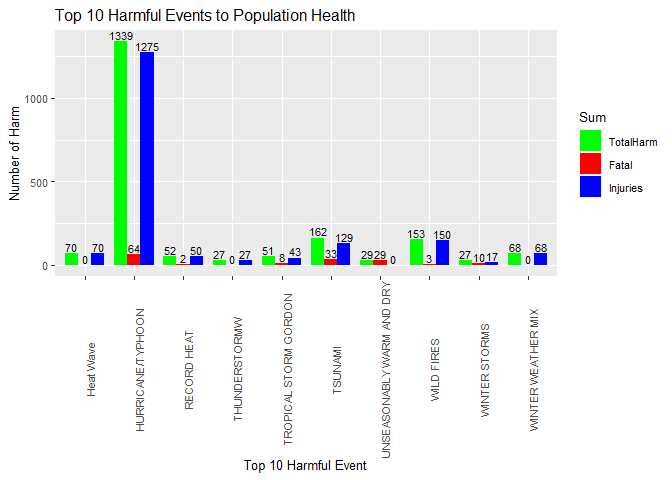
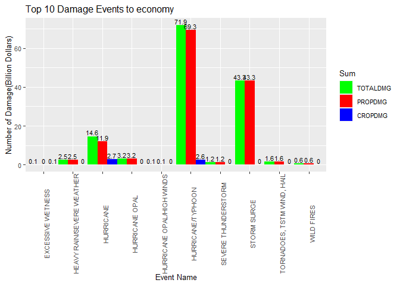

Synopsis
--------

This project determine which weather event is the most harmful to public
health and the greatest economic consequences in US. It uses the data
from the U.S. National Oceanic and Atmospheric Administration’s (NOAA)
storm database. Many severe events can result in fatalities, injuries,
and property damage, and preventing such outcomes to the extent possible
is a key concern.

Data Processing
---------------

### Loading the data

The data download from [this
link](https://d396qusza40orc.cloudfront.net/repdata%2Fdata%2FStormData.csv.bz2)

The explanation of the data check [this
link](https://d396qusza40orc.cloudfront.net/repdata%2Fpeer2_doc%2Fpd01016005curr.pdf)

    myfile <- "repdata_data_StormData.csv.bz2"
    orgdata <- read.csv(myfile, header = TRUE, sep = ",", stringsAsFactors = FALSE)

The explanation of the data Check [this
link](https://d396qusza40orc.cloudfront.net/repdata%2Fpeer2_doc%2Fpd01016005curr.pdf)

### Question1: Across the United States, which types of events are most harmful with respect to population health?

We will use the variables “EVTYPE”,“FATALITIES” and “INJURIES” to find
out the most harmful event to population health.

1.  Select the variables “EVTYPE”,“FATALITIES” and “INJURIES” from
    original data.

<!-- -->

    mydata <- orgdata %>% 
            select("EVTYPE","FATALITIES","INJURIES") %>% 
            filter(!is.na(EVTYPE), !is.na(FATALITIES), !is.na(INJURIES), INJURIES!=0|FATALITIES!=0) %>%
            mutate(TOTALHARM = INJURIES+FATALITIES)
    mysum <- mydata %>% 
            group_by(EVTYPE) %>%
            summarise(minfatal = min(FATALITIES), meanfatal = mean(FATALITIES), 
                      midianfatal = median(FATALITIES), maxfatal = max(FATALITIES),
                      mininjuries = min(INJURIES), meaninjuries = mean(INJURIES), 
                      midianjuries = median(INJURIES), maxjuries = max(INJURIES),
                      mintotal = min(TOTALHARM), meantotal = mean(TOTALHARM), 
                      midiantotal = median(TOTALHARM), maxtotal = max(TOTALHARM))

1.  Top 10 fatalities events.

<!-- -->

    mysum1 <- mysum %>% arrange(desc(meanfatal, meantotal, meaninjuries))
    top10fatalevn <- mysum1$EVTYPE[1:10]
    top10fatal <- mydata %>% 
            filter(EVTYPE %in% top10fatalevn) %>% 
            arrange(desc(FATALITIES, EVTYPE))

The top 10 fatalities events to the population health are UNSEASONABLY
WARM AND DRY, TORNADOES, TSTM WIND, HAIL, RECORD/EXCESSIVE HEAT,
TSUNAMI, COLD AND SNOW, WINTER STORMS, TROPICAL STORM GORDON, EXTREME
HEAT, HEAT WAVE, STORM SURGE/TIDE.

1.  Top 10 injuries events.

<!-- -->

    mysum2 <- mysum %>% arrange(desc(meaninjuries, meantotal, meanfatal))
    top10injuriesevn <- mysum2$EVTYPE[1:10]
    top10injuries <- mydata %>% 
            filter(EVTYPE %in% top10injuriesevn) %>% 
            arrange(desc(INJURIES, EVTYPE))

The top 10 injuries events to the population health are WILD FIRES, Heat
Wave, TSUNAMI, HURRICANE/TYPHOON, TROPICAL STORM GORDON, WINTER WEATHER
MIX, THUNDERSTORMW, WINTRY MIX, RECORD HEAT, BLACK ICE.

1.  Top 10 total harmful events(fatalities + injuries).

<!-- -->

    mysum3 <- mysum %>% arrange(desc(meantotal, meanfatal, meaninjuries))
    top10totalevn <- mysum3$EVTYPE[1:10]
    top10total <- mydata %>% 
            filter(EVTYPE %in% top10totalevn) %>% 
            arrange(desc(TOTALHARM, EVTYPE))

The top 10 harmful events to the population health is WILD FIRES,
TSUNAMI, Heat Wave, HURRICANE/TYPHOON, TROPICAL STORM GORDON, WINTER
WEATHER MIX, UNSEASONABLY WARM AND DRY, THUNDERSTORMW, WINTER STORMS,
RECORD HEAT.

### Question2: Across the United States, which types of events have the greatest economic consequences?

We will calculate the damage of property and crop using the variables
“PROPDMG”, “PROPDMGEXP”, “CROPDMG”, “CROPDMGEXP”. “PROPDMG” and
“PROPDMGEXP” corresponds to the damage in dollars, exponential factor
for property damage (“K” for thousands, “M” for millions, “B” for
billions), “CROPDMG”, “CROPDMGEXP” corresponds to the damage in dollars,
exponential factor for crop damage.

1.  Select the variables “EVTYPE”, “PROPDMG”, “PROPDMGEXP”, “CROPDMG”,
    “CROPDMGEXP” from original data

<!-- -->

    mydamage <- orgdata %>% 
            select("EVTYPE","PROPDMG", "PROPDMGEXP", "CROPDMG", "CROPDMGEXP") %>% 
            filter(!is.na(EVTYPE), !is.na(PROPDMG), !is.na(CROPDMG), PROPDMG!=0|CROPDMG!=0)

1.  Calculate the actual damage values

<!-- -->

    mydamage1 <- mydamage %>% mutate(
            PROPDMG1 = case_when(PROPDMGEXP == "K"|PROPDMGEXP == "k"~PROPDMG*1000,
                                 PROPDMGEXP == "M"|PROPDMGEXP == "m"~PROPDMG*1000000,
                                 PROPDMGEXP == "B"|PROPDMGEXP == "k"~PROPDMG*1000000000,
                                 TRUE~0),
            CROPDMG1 = case_when(CROPDMGEXP == "K"|CROPDMGEXP == "k"~CROPDMG*1000,
                                 CROPDMGEXP == "M"|CROPDMGEXP == "m"~CROPDMG*1000000,
                                 CROPDMGEXP == "B"|CROPDMGEXP == "k"~CROPDMG*1000000000,
                                 TRUE~0)
            )
    mydamage1 <- mydamage1 %>%
            mutate(TOTALDMG = PROPDMG1 + CROPDMG1)%>%
            select(EVTYPE, PROPDMG = PROPDMG1, CROPDMG = CROPDMG1, TOTALDMG)

1.  The top 10 damage events.

<!-- -->

    sumdamage1 <- mydamage1 %>%
            group_by(EVTYPE) %>%
            summarise(meanprop=mean(PROPDMG),medprop=median(PROPDMG),
                      meancrop=mean(CROPDMG),medcrop=median(CROPDMG),
                      meantotal=mean(TOTALDMG),medtotal=median(TOTALDMG)
                      )
    top10damageevn <- arrange(sumdamage1, desc(meantotal))$EVTYPE[1:10]
    top10damage <- mydamage1 %>% 
            filter(EVTYPE %in% top10damageevn) %>% 
            arrange(desc(TOTALDMG, EVTYPE))

The top 10 damage events to the economy is HEAVY RAIN/SEVERE WEATHER,
TORNADOES, TSTM WIND, HAIL, HURRICANE/TYPHOON, HURRICANE OPAL, STORM
SURGE, SEVERE THUNDERSTORM, WILD FIRES, EXCESSIVE WETNESS, HURRICANE,
HURRICANE OPAL/HIGH WINDS.

Results
-------

### Result1:

1.  The plot for top 10 harmful events:

<!-- -->

    sumTotal <- top10total %>% 
            group_by(EVTYPE) %>%
            summarise(TotalHarm=sum(TOTALHARM),Fatal=sum(FATALITIES),Injuries=sum(INJURIES)) %>%
            arrange(desc(TotalHarm,Fatal,Injuries))
    sumTotal1 <- melt(sumTotal, variable.name = "Sum", value.name = "Num")

    ## Using EVTYPE as id variables

    ggplot(sumTotal1, aes(x = EVTYPE,y = Num,fill = Sum))+
            geom_bar(stat ="identity",width = 0.8,position = "dodge")+
            scale_fill_manual(values = c("green","red","blue"))+
            labs(x = "Top 10 Harmful Event",y = "Number of Harm", title = "Top 10 Harmful Events to Population Health")+
            geom_text(aes(label = Num),position=position_dodge(width = 0.8),size = 3,vjust = -0.25)+
            theme(text = element_text(size=10), axis.text.x = element_text(angle=90))

1.  The plot for top 10 fatal events:

<!-- -->

    sumTotal2 <- top10fatal %>% 
            group_by(EVTYPE) %>%
            summarise(Fatal=sum(FATALITIES),TotalHarm=sum(TOTALHARM),Injuries=sum(INJURIES)) %>%
            arrange(desc(Fatal, TotalHarm, Injuries))
    sumTotal22 <- melt(sumTotal2, variable.name = "Sum", value.name = "Num")

    ## Using EVTYPE as id variables

    ggplot(sumTotal22, aes(x = EVTYPE,y = Num,fill = Sum))+
            geom_bar(stat ="identity",width = 0.8,position = "dodge")+
            scale_fill_manual(values = c("red", "green", "blue"))+
            labs(x = "Top 10 Fatal Event",y = "Number of Harm", title = "Top 10 Fatal Events to Population Health")+
            geom_text(aes(label = Num),position=position_dodge(width = 0.8),size = 3,vjust = -0.25)+
            theme(text = element_text(size=10), axis.text.x = element_text(angle=90))

From the plots, we can see the most harmful event is “HURRICANE/TYPHOON”
to population health and the “HEAT WAVE” is the most fatality event.

### Result2:

1.  The plot of top 10 damage events to enconomy:

<!-- -->

    sumTotal <- top10damage %>% 
            group_by(EVTYPE) %>%
            summarise(TOTALDMG=round(sum(TOTALDMG)/1000000000,1),
                      PROPDMG=round(sum(PROPDMG)/1000000000,1),
                      CROPDMG=round(sum(CROPDMG)/1000000000,1)) %>%
            arrange(desc(TOTALDMG))
    sumTotal1 <- melt(sumTotal, variable.name = "Sum", value.name = "Num")

    ## Using EVTYPE as id variables

    ggplot(sumTotal1, aes(x = EVTYPE,y = Num,fill = Sum))+
            geom_bar(stat ="identity",width = 1,position = "dodge")+
            scale_fill_manual(values = c("green","red","blue"))+
            labs(x = "Event Name",y = "Number of Damage(Billion Dollars)", title = "Top 10 Damage Events to economy")+
            geom_text(aes(label = Num),position=position_dodge(width = 1),size = 3,vjust = -0.25)+
            theme(text = element_text(size=10), axis.text.x = element_text(angle=90))

From the plot, we can see the most damage event is “HURRICANE/TYPHOON”
to the economic consequences across the United States.
